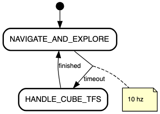
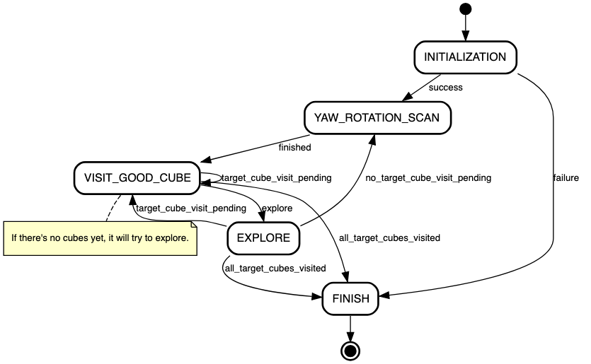

# BEETLE ROVER MISSION

## Running in the simulator
```bash
# Run turtlesim (option 1):
roslaunch mission_control challenge_simulation_1.launch

# Run turtlesim (option 2):
roslaunch mission_control challenge_simulation_random.launch

# Run move_base
roslaunch mission_control move_base_simulation.launch

# Run our simulation
rosrun mission_control run_simulation_mission.py

```

## Running in the rover
```bash
# Add instructions here
```

## Mission State Machine

### General State Machine

Diagram generated using [state-machine-cat](https://github.com/sverweij/state-machine-cat).

### Navigate and Explore State

Diagram generated using [state-machine-cat](https://github.com/sverweij/state-machine-cat).
